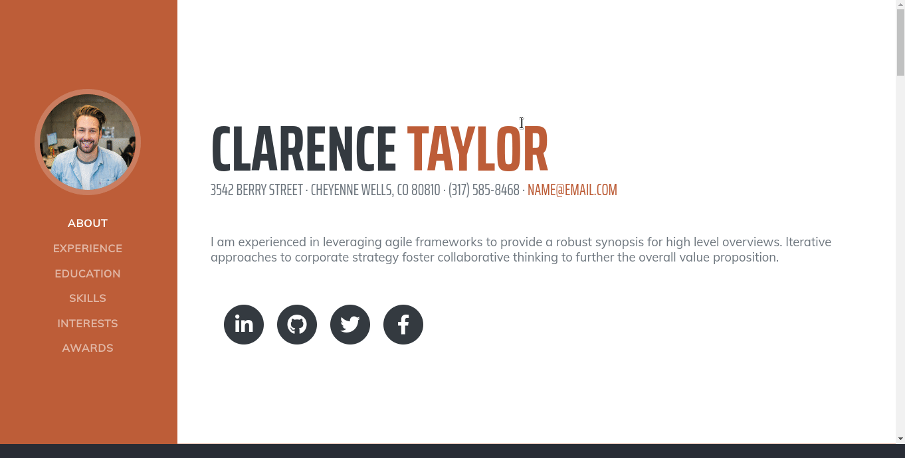
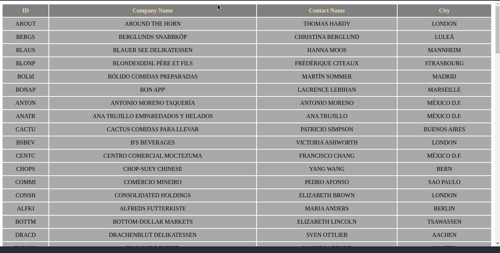
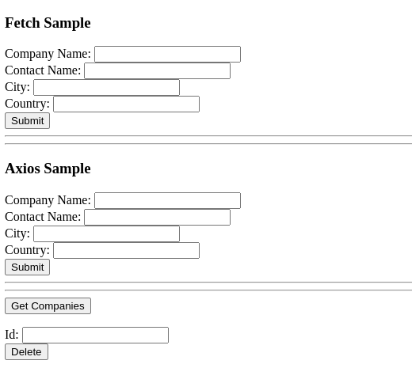
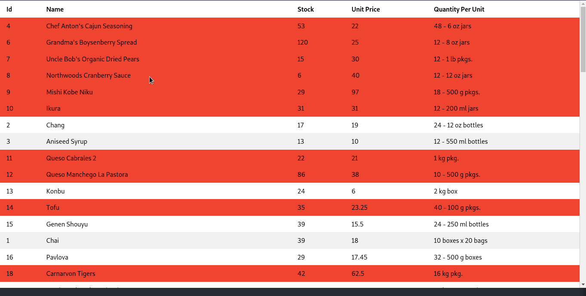
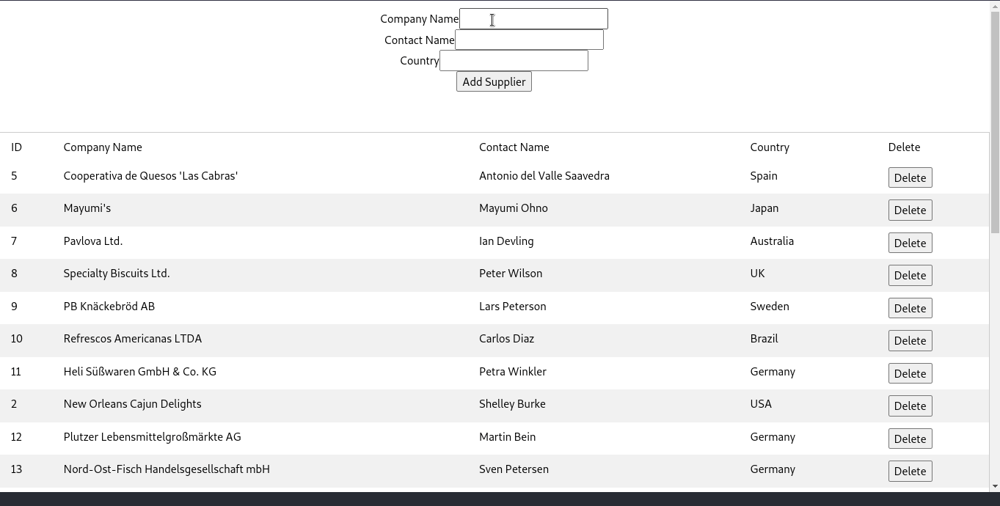
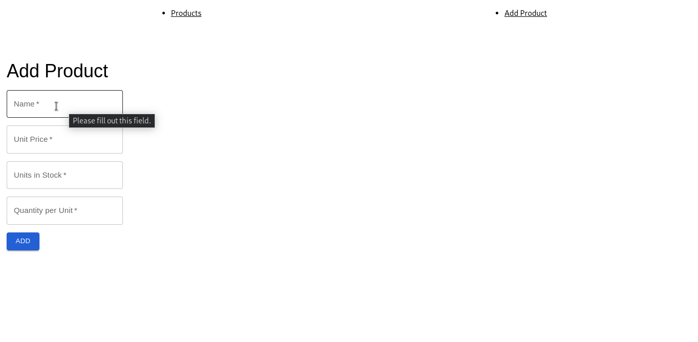
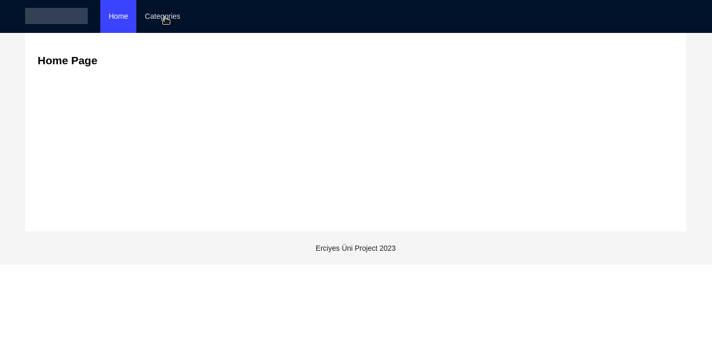

<h1>Erciyes React Bootcamp by Careertech</h1>

This repository contains homeworks for erciyes teknopark react bootcamp

<h2>Homeworks List</h2>

<ol>
<li>25 January- Resume page with html and css</li>
<li>26 January- Taco menu page with flexbox&grid</li>
<li>2 February- Array Function Sample</li>
<li>13 February- Fetch and Axios Sample</li>
<li>16 February- Template page with react components.</li>
<li>20 February- React Api Table</li>
<li>23 February- Table with useState useEffect probs and Axios</li>
<li>28 February- Material Data Grid sample</li>
<li>10 March- Api Update Sample</li>

</ol>

<!-- ----------------------------- -->

<h2>Homework Details</h2>

<ol>
<li>25 January- Resume page with html and css  

 </li>
 

<li>26 January- Taco menu page with flexbox&grid
 

</li>

<li>2 February- Array Function Sample
 

</li>

<li>13 February- Fetch and Axios Sample

 

</li>

<li>16 February- Template page with react components.

 

</li>

<li>20 February- React Api Table

 

</li>

<li>20 February- React Api Table

 

</li>

<li>28 February- Material Data Grid sample

 

</li>

<li>10 March- Api Update Sample

 

</li>

</ol>
